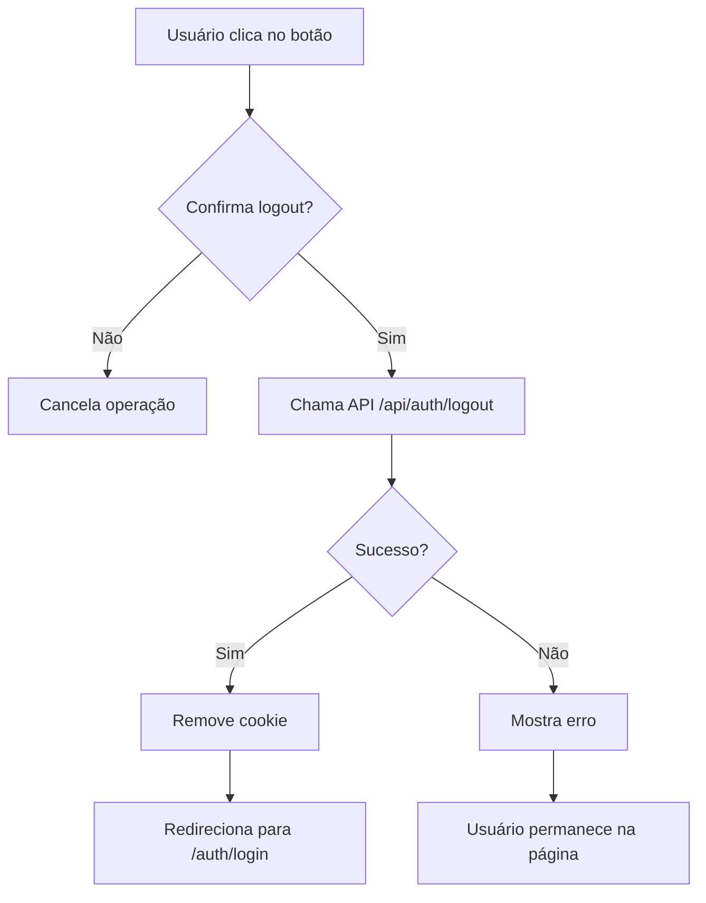

# 🚪 LogoutButton Component

Componente de logout reutilizável para o TradeBox com confirmação e redirecionamento automático.

## 📋 Descrição

Botão que realiza o logout do usuário, chamando a API de logout e redirecionando para a página de login.

## 🎨 Variantes

O componente oferece 3 variantes visuais:

### 1. **Full** (Padrão)
Mostra ícone + texto "Sair"
```tsx
<LogoutButton variant="full" />
```

### 2. **Icon**
Mostra apenas o ícone
```tsx
<LogoutButton variant="icon" />
```

### 3. **Text**
Mostra apenas o texto "Sair"
```tsx
<LogoutButton variant="text" />
```

## 🚀 Uso

### Importação
```tsx
import LogoutButton from "@/components/LogoutButton/LogoutButton";
```

### Exemplos

#### Básico
```tsx
<LogoutButton />
```

#### Com variante customizada
```tsx
<LogoutButton variant="icon" />
```

#### Com classe customizada
```tsx
<LogoutButton variant="full" className="minha-classe" />
```

## 🔧 Props

| Prop | Tipo | Padrão | Descrição |
|------|------|--------|-----------|
| `variant` | `'icon' \| 'text' \| 'full'` | `'full'` | Estilo visual do botão |
| `className` | `string` | `''` | Classe CSS adicional |

## 📱 Comportamento

1. **Clique no botão** → Abre confirmação
2. **Usuário confirma** → Chama API `/api/auth/logout`
3. **API retorna sucesso** → Redireciona para `/auth/login`
4. **Erro** → Mostra mensagem e mantém usuário na página

## 🎯 Fluxo de Logout



## 🎨 Estilos

### Estados do Botão

- **Normal**: Fundo vermelho translúcido
- **Hover**: Fundo mais intenso + elevação
- **Active**: Remove elevação
- **Disabled**: Opacidade reduzida + cursor não permitido
- **Loading**: Texto muda para "Saindo..."

### Cores

- **Cor base**: `#ff3b30` (vermelho)
- **Fundo**: `rgba(255, 59, 48, 0.1)`
- **Hover**: `rgba(255, 59, 48, 0.2)`

## 📐 Responsividade

O componente é totalmente responsivo:

- **Desktop**: Padding 10px 16px, fonte 14px
- **Mobile** (< 768px): Padding 8px 12px, fonte 13px

## 🔐 Segurança

- ✅ Confirmação antes do logout
- ✅ Desabilita botão durante loading
- ✅ Remove cookie de autenticação via API
- ✅ Redireciona automaticamente após logout
- ✅ Trata erros graciosamente

## 🎯 Onde está sendo usado

- `/app/(dashboard)/seller/layout.tsx` - Header do dashboard de varejista
- `/app/(dashboard)/industry/layout.tsx` - Header do dashboard de indústria

## 🧪 Testando

1. Faça login no sistema
2. Navegue para qualquer dashboard (`/seller` ou `/industry`)
3. Clique no botão "Sair" no header
4. Confirme o logout
5. Verifique se foi redirecionado para `/auth/login`

## 🐛 Troubleshooting

### Botão não aparece
- Verifique se o componente foi importado corretamente
- Confirme que o layout está renderizando o componente

### Logout não funciona
- Verifique se a API `/api/auth/logout` está funcionando
- Confirme que o cookie de autenticação existe
- Veja o console do navegador para erros

### Não redireciona após logout
- Verifique se `window.location.href` está funcionando
- Confirme que a rota `/auth/login` existe

## 💡 Dicas

### Customizar cores
Sobrescreva as classes CSS:

```css
.meuBotaoLogout {
  background: rgba(0, 0, 255, 0.1);
  color: blue;
}

.meuBotaoLogout:hover {
  background: rgba(0, 0, 255, 0.2);
}
```

### Mudar texto
Edite o componente diretamente em `LogoutButton.tsx`:

```tsx
<span className={styles.text}>
  {isLoading ? 'Saindo...' : 'Sair da Conta'}
</span>
```

### Remover confirmação
Comente ou remova estas linhas:

```tsx
// const confirmLogout = window.confirm('Deseja realmente sair?');
// if (!confirmLogout) return;
```

## 🔄 Atualização Futura

Possíveis melhorias:

- [ ] Adicionar animação de fade out
- [ ] Suporte a callback customizado
- [ ] Opção de logout sem confirmação
- [ ] Toast notification em vez de alert
- [ ] Suporte a i18n (internacionalização)
- [ ] Analytics tracking de logout

---

**Desenvolvido para TradeBox** 🚀

