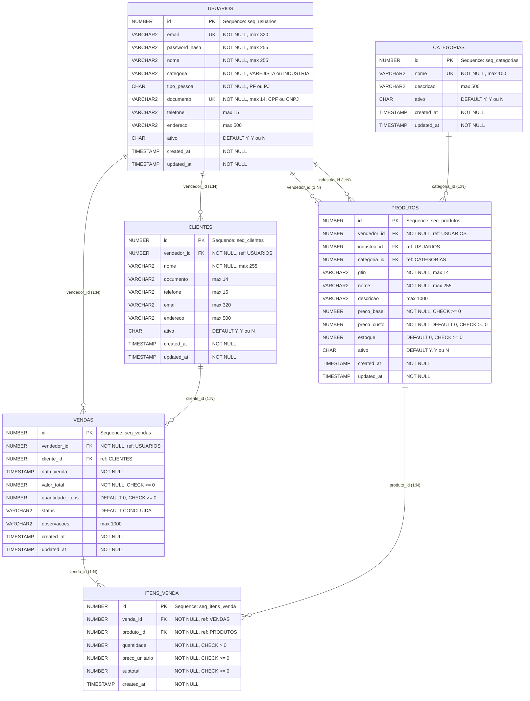

# Diagrama Entidade-Relacionamento - TradeBox

## Sistema de Trade Marketing para Varejistas e Indústrias

---

## Descrição das Entidades

### 1. **USUARIOS**
- **Tipo**: Tabela principal do sistema
- **Descrição**: Armazena usuários do sistema (Varejistas e Indústrias)
- **Categoria**: VAREJISTA ou INDUSTRIA
- **Tipo Pessoa**: PF (Pessoa Física - CPF) ou PJ (Pessoa Jurídica - CNPJ)
- **Regras**:
  - Indústrias devem ser obrigatoriamente PJ
  - Email único e validado por regex
  - CPF: 11 dígitos numéricos
  - CNPJ: 14 dígitos numéricos

### 2. **CATEGORIAS**
- **Tipo**: Tabela auxiliar
- **Descrição**: Categorias de produtos para organização
- **Exemplos**: Alimentos, Bebidas, Higiene, Limpeza, etc.

### 3. **PRODUTOS**
- **Tipo**: Tabela principal
- **Descrição**: Produtos cadastrados pelos vendedores (varejistas)
- **GTIN**: Código de barras global (8-14 dígitos)
- **Relacionamentos**:
  - Pertence a um **vendedor** (VAREJISTA)
  - Pode ter uma **indústria** fornecedora (opcional)
  - Pode ter uma **categoria** (opcional)
- **Precificação**:
  - `preco_base`: Preço de venda ao consumidor
  - `preco_custo`: Preço pago à indústria (pode ser 0 inicialmente)
- **Constraint única**: `(vendedor_id, gtin, industria_id)`

### 4. **CLIENTES**
- **Tipo**: Tabela auxiliar
- **Descrição**: Clientes dos vendedores (opcional nas vendas)
- **Relacionamento**: Pertence a um vendedor

### 5. **VENDAS**
- **Tipo**: Tabela transacional
- **Descrição**: Registro de vendas realizadas
- **Status**: CONCLUIDA, CANCELADA ou PENDENTE
- **Relacionamentos**:
  - Feita por um **vendedor**
  - Pode ter um **cliente** associado (opcional)
- **Campos calculados**:
  - `valor_total`: Soma dos subtotais dos itens
  - `quantidade_itens`: Soma das quantidades dos itens

### 6. **ITENS_VENDA**
- **Tipo**: Tabela transacional (detalhamento)
- **Descrição**: Itens individuais de cada venda
- **Relacionamentos**:
  - Pertence a uma **venda**
  - Referencia um **produto**
- **Campos**:
  - `quantidade`: Unidades vendidas
  - `preco_unitario`: Preço no momento da venda
  - `subtotal`: quantidade × preco_unitario

---

## Relacionamentos

### **1:N (Um para Muitos)**

1. **USUARIOS (VAREJISTA) → PRODUTOS**
   - Um varejista pode cadastrar vários produtos
   - `produtos.vendedor_id` → `usuarios.id`
   - `ON DELETE CASCADE`

2. **USUARIOS (INDUSTRIA) → PRODUTOS**
   - Uma indústria pode fornecer vários produtos
   - `produtos.industria_id` → `usuarios.id`
   - `ON DELETE SET NULL`

3. **USUARIOS → CLIENTES**
   - Um varejista pode ter vários clientes
   - `clientes.vendedor_id` → `usuarios.id`
   - `ON DELETE CASCADE`

4. **USUARIOS → VENDAS**
   - Um varejista pode fazer várias vendas
   - `vendas.vendedor_id` → `usuarios.id`
   - `ON DELETE CASCADE`

5. **CATEGORIAS → PRODUTOS**
   - Uma categoria pode ter vários produtos
   - `produtos.categoria_id` → `categorias.id`
   - `ON DELETE SET NULL`

6. **CLIENTES → VENDAS**
   - Um cliente pode ter várias vendas
   - `vendas.cliente_id` → `clientes.id`
   - `ON DELETE SET NULL`

7. **VENDAS → ITENS_VENDA**
   - Uma venda pode ter vários itens
   - `itens_venda.venda_id` → `vendas.id`
   - `ON DELETE CASCADE`

8. **PRODUTOS → ITENS_VENDA**
   - Um produto pode estar em vários itens de venda
   - `itens_venda.produto_id` → `produtos.id`

---

## Índices para Performance

### **USUARIOS**
- `idx_usuarios_email` (UNIQUE) → email
- `idx_usuarios_documento` (UNIQUE) → documento
- `idx_usuarios_categoria` → categoria
- `idx_usuarios_ativo` → ativo

### **CATEGORIAS**
- `idx_categorias_ativo` → ativo

### **PRODUTOS**
- `idx_produtos_vendedor` → vendedor_id
- `idx_produtos_industria` → industria_id
- `idx_produtos_categoria` → categoria_id
- `idx_produtos_gtin` → gtin
- `idx_produtos_ativo` → ativo
- `idx_produtos_estoque` → estoque
- `idx_produtos_margem` → (preco_base, preco_custo)

### **CLIENTES**
- `idx_clientes_vendedor` → vendedor_id
- `idx_clientes_ativo` → ativo

### **VENDAS**
- `idx_vendas_vendedor` → vendedor_id
- `idx_vendas_cliente` → cliente_id
- `idx_vendas_data` → data_venda
- `idx_vendas_status` → status

### **ITENS_VENDA**
- `idx_itens_venda` → venda_id
- `idx_itens_produto` → produto_id

---

## Triggers de Auditoria

Todas as tabelas principais possuem triggers que atualizam automaticamente o campo `updated_at`:

- `trg_usuarios_updated_at`
- `trg_categorias_updated_at`
- `trg_produtos_updated_at`
- `trg_clientes_updated_at`
- `trg_vendas_updated_at`

---

## Constraints Adicionais

1. **Indústrias devem ter CNPJ**: `chk_industria_cnpj`
2. **Email válido**: `chk_email_format` (regex)
3. **CPF válido**: `chk_cpf_format` (11 dígitos)
4. **CNPJ válido**: `chk_cnpj_format` (14 dígitos)
5. **Preço custo ≤ Preço base**: `chk_preco_custo_valido`

---

## Fluxo de Dados Típico

1. **Cadastro de Usuário** (VAREJISTA ou INDUSTRIA)
2. **Cadastro de Categorias** (sistema)
3. **Cadastro de Produtos** (VAREJISTA)
   - Pode associar uma INDUSTRIA
   - Pode associar uma CATEGORIA
4. **Cadastro de Clientes** (VAREJISTA) - opcional
5. **Registro de Venda** (VAREJISTA)
   - Cria registro em VENDAS
   - Adiciona itens em ITENS_VENDA
   - Atualiza estoque dos PRODUTOS
6. **Indústria define preço de custo** (INDUSTRIA)
   - Atualiza `preco_custo` em PRODUTOS

---

## Versão
- **Database**: Oracle 19c+
- **Projeto**: TradeBox - Sistema de Trade Marketing
- **Data**: 2025
- **Instituição**: FIAP

